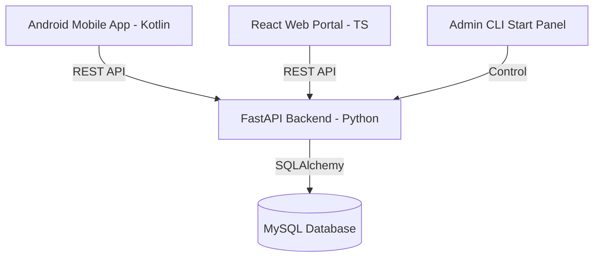

# ♻️ EcoCollect: Smart Waste Management System

EcoCollect is a multi-platform smart waste management solution designed to bridge the gap between citizens, cleanup supervisors, and municipality administrators. By leveraging real-time geo-location, mobile/web interfaces, and automated workflows, EcoCollect optimizes waste reporting, tracking, and collection procedures to foster cleaner, greener communities.

---

## 🎯 Why We Built This (Problem & Vision)

Traditional waste management pipelines rely on schedule-based sweeps, leading to several inefficiencies:
* **Delayed Response**: Waste heaps remain uncollected for days because authorities are unaware.
* **Lack of Accountability**: No easy way to verify if or when a cleanup crew resolved an issue.
* **Community Disengagement**: Citizens lack visibility and incentives to report issues or participate in keeping their areas clean.

**EcoCollect solves this by**:
1. Empowing **citizens** to instantly report trash piles with photos and automatic GPS coordinates.
2. Incentivizing reports through a gamified **Eco-Points** system.
3. Supplying **cleanup supervisors** with route tracking and performance diagnostics.
4. Equipping **municipal admins** with a comprehensive map dashboard, supervisor dispatch tools, and spatial waste analytics (hotspot heatmaps).

---

## 🏗️ System Architecture & Technologies

EcoCollect is structured as a modular monorepo containing four core components:



### 1. Backend API (Python & FastAPI)
* **Framework**: FastAPI (asynchronous, high-performance web framework).
* **ORM**: SQLAlchemy with PyMySQL connection driver.
* **Database**: MySQL / MariaDB (fully compatible with XAMPP).
* **Authentication**: JWT (JSON Web Tokens) with custom role access scopes and password hashing using Bcrypt.
* **Mailer**: SMTP configuration for automatic OTP notifications.

### 2. Web Portal (React & TypeScript)
* **Framework**: React 18, TypeScript, and Vite.
* **Styling**: Tailwind CSS with Radix UI primitives.
* **Routing**: React Router DOM.
* **Charts & Maps**: Leaflet maps for geolocation rendering.

### 3. Mobile Client (Android Kotlin)
* **UI**: Jetpack Compose (Modern native Android UI toolkit).
* **Networking**: Ktor Client with OkHttp engine and Kotlinx Serialization.
* **Maps**: Google Play Services Maps API.

### 4. Database Schema
* Structured MySQL schema defining relational schemas for `users`, `supervisors`, `issue_reports`, `issue_history`, `notifications`, `activity_logs`, and `otps`.

---

## 👥 Usecases & User Roles

| Feature | 👤 Citizen | 👷 Supervisor | 👑 Administrator |
| :--- | :---: | :---: | :---: |
| **Authentication** | Sign up / Sign in, OTP Reset | Employee Login | Default Admin Credentials |
| **Issue Reporting**| Submit report with GPS & image | View assigned/nearby tasks | Oversee all reported issues |
| **Dispatch / Assignment** | - | - | Manually assign reports to supervisors |
| **Task Completion** | - | Mark resolved with completion photo | Review historical audit logs |
| **Analytics & Maps**| View nearby issues on map | Get routing path to issues | Real-time hotspot heatmap & stats |
| **Eco-Points** | Earn points upon validation | - | - |
| **Activity Log** | Profile modification logged | Task completions audited | Global system activity monitor |

---

## 📝 Activity Logs & System Auditing (`app_logs`)

To ensure compliance and security across the municipal system, the backend implements an **Activity Logging** mechanism. Every critical action triggers a persistent audit record in the `activity_logs` table:

* **`login`**: Tracks user access times across roles.
* **`create`**: Logged whenever citizens submit new reports or admins register supervisors.
* **`update`**: Logs profile edits, user status updates, and assignment shifts.
* **`delete`**: Records deletions of records for integrity auditing.
* **`security`**: Records password changes, password reset requests, and security modifications.

---

## ⚡ Quick Start Guide

### 1. Database Setup
1. Start Apache and MySQL in your **XAMPP Control Panel**.
2. Run the database setup script to initialize the schema and insert the default admin credentials:
   ```bash
   cd backend
   python clean_db.py
   ```

### 2. Backend Setup
1. Navigate to the backend folder:
   ```bash
   cd backend
   ```
2. Activate your virtual environment and start the Uvicorn dev server using the custom CLI helper script:
   ```bash
   python start.py
   ```
   * Access the interactive API docs at: **`http://localhost:8000/docs`**

### 3. Web Setup
1. Navigate to the web folder:
   ```bash
   cd web
   ```
2. Install packages and run the development server:
   ```bash
   npm install
   npm run dev
   ```
   * Open the dashboard at: **`http://localhost:5173/`**

### 4. Frontend Setup
1. Open the `frontend` directory in **Android Studio**.
2. Configure the server IP address inside `src/main/java/com/wastereporting/network/ApiService.kt` (using your local machine IP from `ipconfig` / `ifconfig`).
3. Sync Gradle and run the application on an emulator or physical test device.
