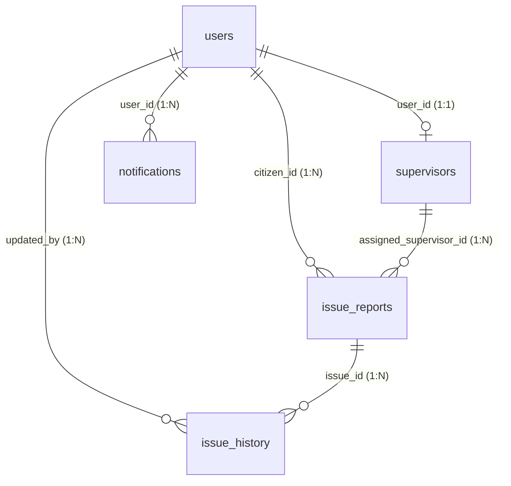

# ⚙️ EcoCollect: System Architecture & Technical Specifications

This document outlines the system design, communication protocols, database schema mechanics, and component integrations of the EcoCollect Smart Waste Management System.

---

## 🛠️ Component Overview & Communication

EcoCollect is structured as a decoupled multi-client system connected to a central REST API.

```
+------------------------------------------------------------+
|                       MySQL Database                       |
+------------------------------------------------------------+
                              ^
                              | SQLAlchemy ORM
                              v
+------------------------------------------------------------+
|                  Python FastAPI REST API                   |
|                      (Port 8000)                           |
+------------------------------------------------------------+
          ^                                        ^
          | HTTP REST                              | HTTP REST
          v                                        v
+-----------------------+                +-----------------------+
|   React Web Portal    |                |  Android Mobile App   |
|   (Vite, Port 5173)   |                |  (Kotlin/Compose)     |
+-----------------------+                +-----------------------+
```

### 1. Central API Backend
* **Technology**: Python 3.10+, FastAPI.
* **Server**: Uvicorn worker process.
* **Database Driver**: SQLAlchemy (ORM) + PyMySQL (MySQL connector).
* **Role**: Exposes secure endpoints for user management, issue reporting, image uploads, task assignment, status updates, and system diagnostics.

### 2. Administrator & Citizen Web Dashboard
* **Technology**: React 18 (TypeScript), Vite.
* **Role**: Admin oversight panel for dispatching cleanup crews, monitoring real-time issue coordinates on dynamic maps, viewing municipal performance graphs, and auditing system logs.

### 3. Citizen & Supervisor Android Application
* **Technology**: Kotlin, Jetpack Compose.
* **Networking**: Ktor Client (OkHttp engine) for asynchronous request dispatching.
* **Role**: Allows citizens to capture geotagged photos of overflowing trash bins and lets field supervisors claim, route, and resolve tasks.

---

## 🗺️ Geolocation & Routing Engine

To optimize cleanup crew response times, EcoCollect integrates a routing pipeline for supervisors:

* **Geotagging**: Reports utilize decimal GPS coordinates (`Latitude: DECIMAL(10, 8)`, `Longitude: DECIMAL(11, 8)`), which provide sub-meter precision.
* **Routing API**: The supervisor portal utilizes the **Open Source Routing Machine (OSRM)** API to generate driving routes:
  `https://router.project-osrm.org/route/v1/driving/{start_lng},{start_lat};{end_lng},{end_lat}`
* **Route Details**: The response yields a polyline decoded into a geographic path, together with travel duration (seconds) and distance (meters) for turn-by-turn map rendering.

---

## 🗄️ Database Relationships & Indexing

The relational MySQL database contains 7 tables designed for integrity and query performance:



### Cascade Rules & Constraints
* **`supervisors` -> `users`**: Foreign key `user_id` has `ON DELETE CASCADE`. Removing a user profile automatically deletes the supervisor profile.
* **`issue_reports` -> `users`**: Foreign key `citizen_id` has `ON DELETE CASCADE`.
* **`issue_reports` -> `supervisors`**: Foreign key `assigned_supervisor_id` has `ON DELETE SET NULL`. If a supervisor is removed, the report is not deleted; it returns to the unassigned queue.
* **`issue_history` -> `issue_reports`**: Foreign key `issue_id` has `ON DELETE CASCADE`.

### Indexes for High Performance
To optimize database scans under scale, indices are established on the following search columns:
* `idx_users_email` on `users(email)`
* `idx_supervisors_employee` on `supervisors(employee_id)`
* `idx_issues_citizen` on `issue_reports(citizen_id)`
* `idx_issues_status` on `issue_reports(status)`
* `idx_otps_email` on `otps(email)`

---

## 📈 Activity Log Auditing Structure

The `activity_logs` table registers all sensitive operations to maintain compliance:
* **User Actions Audited**: Logins, supervisor registrations, security settings modifications, issue status closures.
* **Table Fields**:
  * `id`: Primary key.
  * `action`: Action description (e.g. `Profile Updated`, `Supervisor Registered`).
  * `type`: Action category (`login`, `create`, `update`, `delete`, `report`, `security`).
  * `details`: Descriptive JSON string containing operation metadata.
  * `created_at`: Automatic timestamp.
